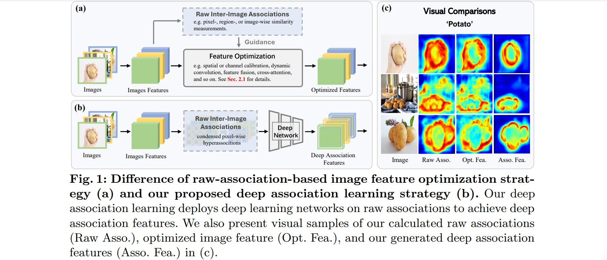
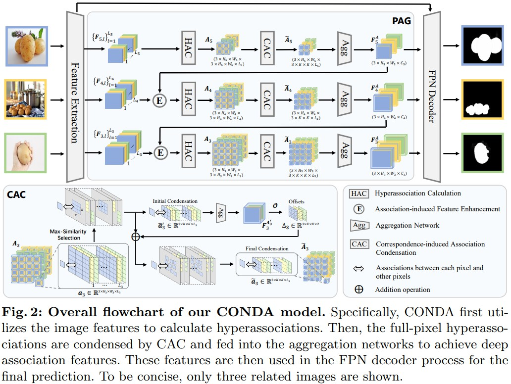
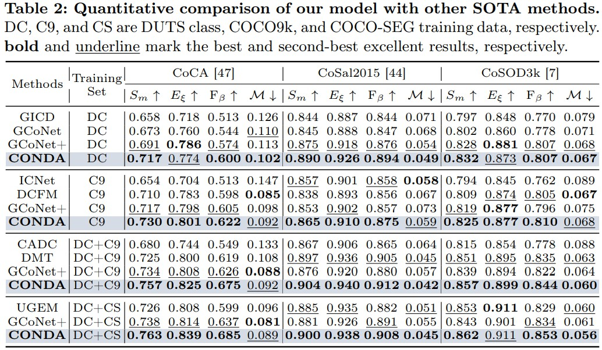
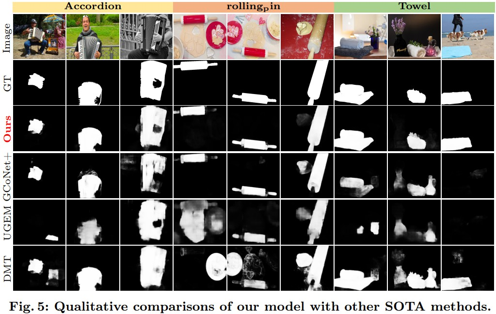

# CONDA
Code release for the ECCV 2024 paper "CONDA: Condensed Deep Association Learning for Co-Salient Object Detection" by Long Li, Junwei Han*, Dingwen Zhang, Zhongyu Li, Salman Khan, Rao Anwer, Hisham Cholakkal, Nian Liu*, Fahad Shahbaz Khan

  

  

## Abstract
Inter-image association modeling is crucial for co-salient object detection. Despite satisfactory performance, previous methods still have limitations on sufficient inter-image association modeling. Because most of them focus on image feature optimization under the guidance of heuristically calculated raw inter-image associations. They directly rely on raw associations which are not reliable in complex scenarios, and their image feature optimization approach is not explicit for inter-image association modeling. To alleviate these limitations, this paper proposes a deep association learning strategy that deploys deep networks on raw associations to explicitly transform them into deep association features. Specifically, we first create hyperassociations to collect dense pixel-pair-wise raw associations and then deploys deep aggregation networks on them. We design a progressive association generation module for this purpose with additional enhancement of the hyperassociation calculation. More importantly, we propose a correspondence-induced association condensation module that introduces a pretext task, i.e. semantic correspondence estimation, to condense the hyperassociations for computational
burden reduction and noise elimination. We also design an object-aware cycle consistency loss for high-quality correspondence estimations. Experimental results in three benchmark datasets demonstrate the remarkable effectiveness of our proposed method with various training settings.

## Result
The prediction results of our dataset can be download from [prediction](https://pan.baidu.com/s/1vS3d0Jk0PygoL2FbHuM69Q?pwd=g5hd) (g5hd).

  
  

## Environment Configuration
- Linux with Python ≥ 3.6
- PyTorch ≥ 1.7 and [torchvision](https://github.com/pytorch/vision/) that matches the PyTorch installation.
  Install them together at [pytorch.org](https://pytorch.org) to make sure of this. Note, please check
  PyTorch version matches that is required by Detectron2.
- Detectron2: follow [Detectron2 installation instructions](https://detectron2.readthedocs.io/tutorials/install.html).
- OpenCV is optional but needed by demo and visualization
- `pip install -r requirements.txt`

## Data Preparation
Download the dataset from [Baidu Driver](https://pan.baidu.com/s/192MnRSgXSDXb0l7mJZ18ng) (cxx2) and unzip them to './dataset'. Then the structure of the './dataset' folder will show as following:
````
-- dataset
   |-- train_data
   |   |-- | CoCo9k
   |   |-- | DUTS_class
   |   |-- | DUTS_class_syn
   |   |-- |-- | img_png_seamless_cloning_add_naive
   |   |-- |-- | img_png_seamless_cloning_add_naive_reverse_2
   |-- test_data
   |   |-- | CoCA
   |   |-- | CoSal2015
   |   |-- | CoSOD3k
````

## Training model
1. Download the pretrained VGG model from [Baidu Driver](https://pan.baidu.com/s/173-1VToeumXZy90cRw-Yqw)(sqd5) and put it into `./checkpoints` folder.
2. Run `python train.py`. 
3. The trained models with satisfactory performance will be saved in `./checkpoints/CONDA/`.


## Testing model
1. Download our trained model from [DUTS+CoCo9k](https://pan.baidu.com/s/1_yC8_p3GeCcvs_lAGUFfvg?pwd=qxye) (qxye) or [DUTS+CoCoSeg]( https://pan.baidu.com/s/1TzTOWl3q31WTIr8Wit9fFg?pwd=1qiy) (1qiy) and put them into `./checkpoint/CVPR2023_Final_Code` folder.
3. Run `python test.py`.
4. The prediction images will be saved in `./prediction`. 
5. Run `python ./evaluation/eval_from_imgs.py` to evaluate the predicted results on three datasets and the evaluation scores will be written in `./evaluation/result`.
